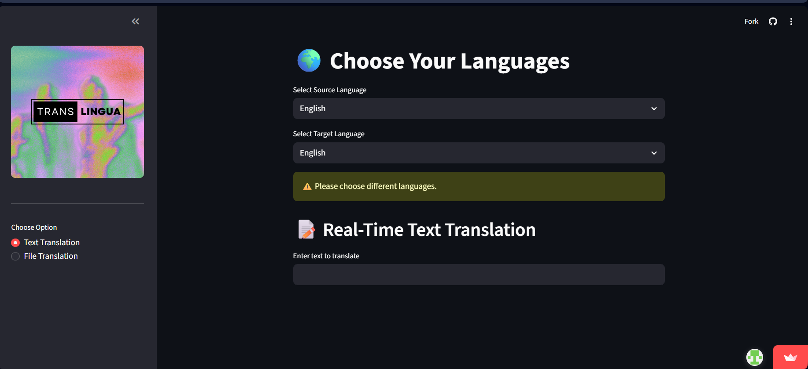
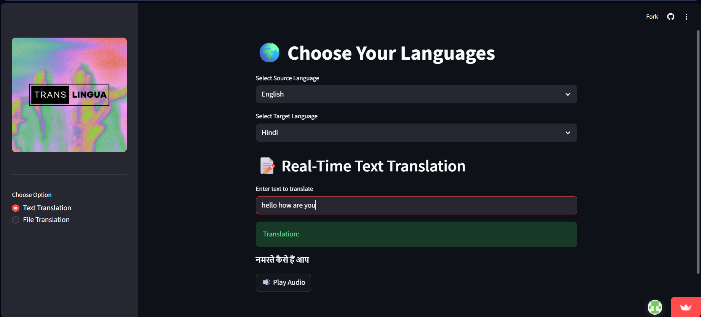
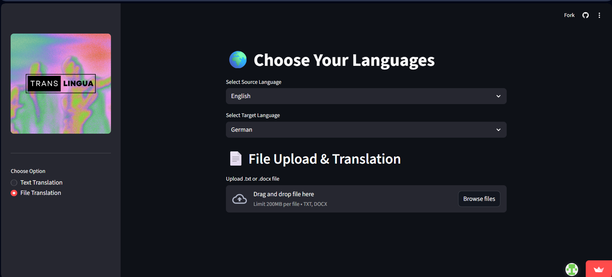

# 🌍 TransLingua Pro – AI-Powered Multi-Language Translator

🚀 **Live Demo:**  
https://translingua-pro-khr2hr5kstsdvdkrcda2gu.streamlit.app

---

## 📌 Project Overview

TransLingua Pro is an AI-powered multi-language translation web application built using Streamlit and integrated with a Large Language Model (LLM) via LangChain and Groq API.

The application helps users overcome language barriers by providing accurate and fast translations between multiple languages through a simple and user-friendly web interface.

This project was developed as part of the SmartBridge Virtual Internship Program and demonstrates real-world implementation of Generative AI technologies.

---

## ✨ Features

- 🌐 Multi-language text translation
- 📄 File translation (.txt and .docx support)
- 🔊 Text-to-speech audio playback
- ⚡ Fast LLM-powered responses
- 🔐 Secure API key handling using environment variables
- ☁️ Deployed on Streamlit Cloud
- 📘 Structured academic documentation included

---

## 🛠 Tech Stack

### Programming Language
- Python 3.10+

### Framework
- Streamlit

### LLM Integration
- LangChain
- Groq API (LLaMA 3 Model)

### Libraries
- gTTS (Text-to-Speech)
- python-docx (Document Processing)
- python-dotenv (Environment Management)

### Version Control
- Git & GitHub

### Deployment
- Streamlit Cloud

---

---

## 📂 Project Structure

```
TransLingua-Pro/
│
├── app.py
├── requirements.txt
├── runtime.txt
├── README.md
├── .gitignore
│
├── Documentation/
│   ├── 1. Ideation Phase/
│   ├── 2. Requirement Analysis/
│   ├── 3. Project Design Phase/
│   ├── 4. Project Planning Phase/
│   ├── 5. Project Development Phase/
│   └── 6. Project Documentation/
│
├── Images/
│   ├── home.png
│   ├── translation.png
│   └── file_translation.png
│
└── Demo_Video.mp4
```

## 🔐 Security Implementation

Security was given high priority during development:

- API keys are stored using environment variables
- `.env` file is excluded via `.gitignore`
- No sensitive credentials are hardcoded
- Streamlit Cloud Secrets Manager is used for production deployment

This ensures secure handling of API credentials.

---

## ⚙️ How to Run Locally

1. Clone the repository:
```
git clone https://github.com/OjeswariDevi/TransLingua-Pro.git
```

2. Navigate into the project folder:

```
cd TransLingua-Pro
```

3. Install dependencies:

```
pip install -r requirements.txt
```

4. Create a `.env` file and add your API key:

```
GROQ_API_KEY=your_api_key_here
```

5. Run the application:

```
streamlit run app.py
```
---

## 📸 Application Screenshots

### 🔹 Home Page


### 🔹 Text Translation Output


### 🔹 File Translation

---


## 🎥 Project Demo Video

Watch the complete working demo of **TransLingua Pro** here:

🔗 [Click here to watch the demo video](https://drive.google.com/file/d/1eNT3EjlwV32iZC6URv3GI1PXMYTgUQ_8/view)

---